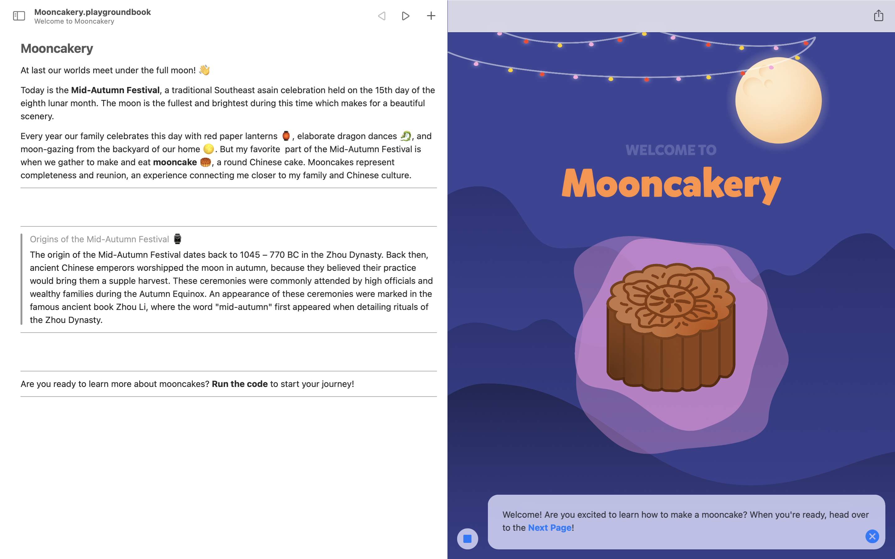

# Mooncakery

## Overview
Mooncakery teaches you how to create a mooncake and their significance in Chinese culture during the Mid-Autumn Festival. It's a playground book that uses UIKit, Core Animation, and Core Graphics. Growing up, I always looked forward to the Mid-Autumn Festival, a celebration held on the 15th day of the eighth lunar month. The tradition of eating mooncakes with my friends and family compelled me to share the experience with others.

Watch a [demo of Mooncakery](https://youtu.be/22fNhZOYoHc)!

## Try it yourself
Here's how you can play with Mooncakery:
1. Download [Swift Playgrounds](https://www.apple.com/swift/playgrounds/) on your Mac or iPad
2. Download and open the [Mooncakery.playgroundbook.zip](Mooncakery.playgroundbook.zip) file onto your device. This will prompt the Swift Playgrounds app to begin Mooncakery.
